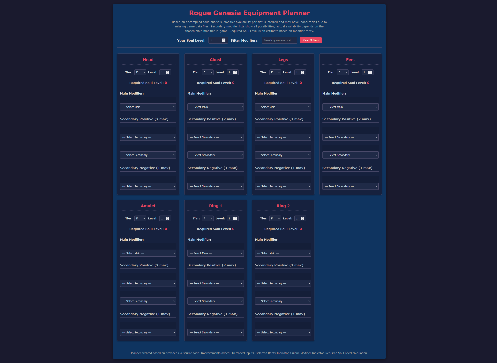

# Rogue Genesia Equipment Planner

A web-based tool designed for players of the game *Rogue Genesia*. It allows you to select equipment modifiers for each slot, visualize their effects based on item tier and level, and calculate the estimated required Soul Level for your build.



## Features

*   **Slot-Based Planning:** Select Main and Secondary (Positive/Negative) modifiers for each equipment slot (Head, Chest, Legs, Feet, Amulet, Ring1, Ring2).
*   **Tier & Level Adjustment:** Set Item Tier (F to SSS) and Level (1-10) for each slot individually.
*   **Dynamic Effect Calculation:** View calculated modifier effects that update based on the selected Tier and Level.
*   **Required Soul Level Estimation:** See the estimated Required Soul Level needed to activate the item in each slot, based on selected modifiers, tier, and level.
    *   *Note: Negative secondary modifiers correctly reduce the required level in this planner.*
*   **Player Level Input:** Input your current Player Soul Level to see which planned items would be active (inactive slots are dimmed).
*   **Modifier Filtering:** Quickly find modifiers by searching for their name or effect text in the dropdown lists.
*   **Clear Functionality:** Reset all selections with a single button click.
*   **Organized Modifiers:** Dropdown lists group modifiers by rarity for easier navigation.
*   **Visual Cues:**
    *   Selected modifiers display a border colored according to their rarity.
    *   Unique rarity modifiers are marked with a star (⭐) in the list.
*   **Tooltips:** Hover over modifier options for their descriptions (where available).

## How to Use

1.  **Clone or Download:** Get the project files onto your local machine.
    ```bash
    git clone https://github.com/MubarakHAlketbi/RG_planner.git
    ```
    (Replace with your actual repository URL) OR download the ZIP file from GitHub.
2.  **Open:** Navigate to the downloaded folder and open the `index.html` file in your preferred web browser.
3.  **Plan Your Build:**
    *   Use the dropdown menus within each equipment slot card to select your desired Main and Secondary modifiers.
    *   Adjust the "Tier" and "Level" inputs for each slot to match the item you are planning. The modifier effects and required level will update automatically.
    *   Enter your character's current "Soul Level" in the input field at the top of the page. Slots requiring a higher level will appear dimmed.
    *   Use the "Filter Modifiers" input to search for specific stats or modifier names if needed.
    *   Click the "Clear All Slots" button to reset the planner.

## Technology Stack

*   HTML5
*   CSS3 (Vanilla)
*   JavaScript (Vanilla)

## Data Source & Accuracy Disclaimer

*   **Source:** The modifier data, stats, scaling formulas, and calculation logic used in this planner are derived *exclusively* from the decompiled C# source code provided.
*   **Incompleteness:** The provided source code might not represent the entirety of the game's data or logic. Crucially, data defining which specific secondary modifiers are available for each *unique main modifier* was not present and could not be implemented. Therefore, the secondary modifier lists show *all* possible secondaries of the correct positivity, regardless of the chosen main modifier.
*   **Estimations:** Some values, particularly the base `requiredLevelModifier` for each stat, were estimated based on observed patterns (like rarity) as they weren't explicitly defined constants in the provided snippets for every modifier.
*   **Calculation Accuracy:** While the JavaScript calculations aim to faithfully replicate the logic found in the C# code (including specific formulas for custom `EM_` modifiers and God Stones), minor discrepancies might exist due to potential decompilation inaccuracies or differences in floating-point handling between C# and JavaScript.
*   **Soul Level Calculation:** The required Soul Level calculation follows the formula derived from the C# code (`GetBaseRequiredCardLevel` * `GetTierCardLevelEffect`), with one key adjustment: **Negative secondary modifiers are treated as *reducing* the required level**, based on gameplay intuition, even though the raw decompiled `GetBaseRequiredCardLevel` function appeared to simply sum all modifier costs.

**In summary:** This tool provides a valuable planning aid based on the available code, but treat the results (especially required Soul Level and secondary modifier compatibility) as **estimates**. Always verify against in-game behavior.

## Potential Future Improvements

*   Save/Load build configurations (using LocalStorage).
*   Shareable build links (using URL parameters).
*   Integration of more accurate data if full game files become available (e.g., secondary restrictions).
*   Visual equipment icons per slot.
*   A summary panel showing total stats from the build.

## Contributing

Contributions are welcome! If you have more accurate data, find bugs, or want to add features, feel free to open an issue or submit a pull request.

## License

This project is provided as-is. Use at your own discretion.